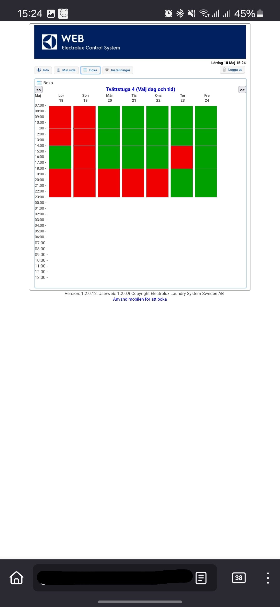

# Moydodyr API
A better implementation of the ELS booking system.

Link to diagrams: https://github.com/myxit/my-diag/blob/main/moydodyr/

## Python Dev setup
A bit complex setup:
 - Python version in venv is `3.11.4`
 - Packages managed by the `poetry` package manager. Run `poetry install` in the project directory root.

## Plan
0. "Fasade"
 - [X] authentication
 - [X] booknigs scraper
 - [X] bookings parser
 - [-] booking reservation
 - [] booking cancellation 
 
1. JSON API
    - GET /api/bookings returns JSON occupied bookings
    - GET /api/bookings returns JSON all bookings
    - POST /api/bookings
    - DELETE /api/bookings
 - [ ] Authentication 
2. Good to have
 - [] poller daemon
 - [] SSE
